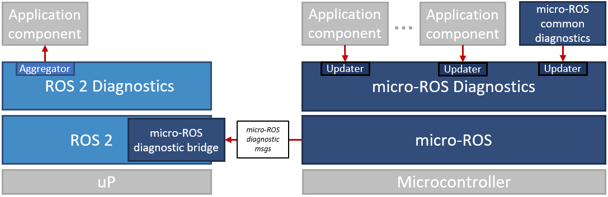

General information about this repository, including legal information, build instructions and known issues/limitations, can be found in the [README](./README.md) of the repository root.

# The micro-ROS diagnostics framework packages

This [ROS 2](https://index.ros.org/doc/ros2/) package provides a simple diagnostics framework for micro-ROS, built against rclc:

* [micro_ros_diagnostic_msgs](./micro_ros_diagnostic_msgs/) - Diagnostic messages suited for micro-ROS, e.g., no use of arrays
* [micro_ros_diagnostic_updater](./micro_ros_diagnostic_updater/) - rclc convenience functions for diagnostic updaters, publishing micro-ROS diagnostic messages (see above)
* [micro_ros_common_diagnostics](./micro_ros_common_diagnostics/) - Micro-controller specific monitors

The micro-ROS diagnostics packages do not provide any aggregator as we assume that such aggregation takes place on a microprocessor running standard ROS 2. Hence, we assume the following typical architecture:

In order for the standard ROS 2 diagnostic aggregator to aggregate micro-ROS diagnostic message types, the ROS 2 agent has to translate micro-ROS diagnostic messages to standard ROS 2 diagnostic messages (*tbd*).

For further information, please contact [Arne Nordmann](https://github.com/norro) or [Ralph Lange](https://github.com/ralph-lange).

## Purpose of the Project

This software is not ready for production use. It has neither been developed nor
tested for a specific use case. However, the license conditions of the
applicable Open Source licenses allow you to adapt the software to your needs.
Before using it in a safety relevant setting, make sure that the software
fulfills your requirements and adjust it according to any applicable safety
standards, e.g., ISO 26262.

## How to Build, Test, Install, and Use

After you cloned this repository into your ROS 2 workspace folder, you may build and install it using colcon:
$ `colcon build --packages-select-regex micro_ros_.*diagn`

## License

The micro-ROS diagnostics framework packages are open-sourced under the Apache-2.0 license. See the [LICENSE](LICENSE) file for details.

For a list of other open-source components included in ROS 2 system_modes,
see the file [3rd-party-licenses.txt](3rd-party-licenses.txt).

## Known Issues/Limitations

Please notice the following issues/limitations:

1. Due to limitations in the Micro-ROS agent, the micro-ROS diagnostics framework can't (yet) publish the default ROS 2 diagnostic messages [diagnostic_msgs](https://github.com/ros2/common_interfaces/tree/master/diagnostic_msgs), but provides simplified versions of the diagnostic messages and services that go without arrays, [MicroROSDiagnosticStatus](./micro_ros_diagnostic_msgs/msg/MicroROSDiagnosticStatus.msg) and [MicroROSSelfTest](./micro_ros_diagnostic_msgs/srv/MicroROSSelfTest.srv). These simplified messages and services will have to be translated by the agent or a 3rd party.

## Acknowledgments

This activity has received funding from the European Research Council (ERC) under the European Union's Horizon 2020 research and innovation programme (grant agreement n° 780785).
